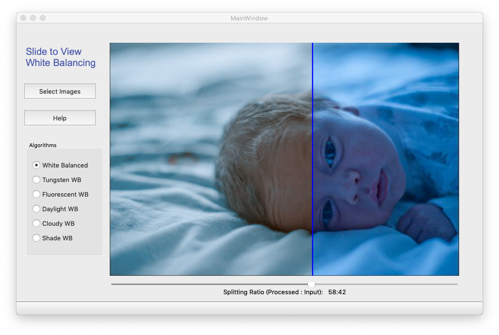

# Algorithm-Performance-Viewer
This UI can show the image processing performance in a vivid way, using a slider to watch over the input and output's differences.

## Announcement
This UI is based on the project of [Deep White Balancing](https://github.com/mahmoudnafifi/Deep_White_Balance)

## Pre-requirements
>PyQt5 (QtChart)

>Opencv-python

## Usage
Before runing the demo, put all the images, including original images, output images into a folder, when the folder is selected, all images will be read.
```
python demo.py
```

As the UI showed above, you can use the slider on the buttom to adjust the ratio of the input image and processed image. You can also select different algorithms, as long as the corresponding processed images are in the folder.

## Things to be improved
Some bugs, processing images with extreme width-height ratio, etc

> To be continued...